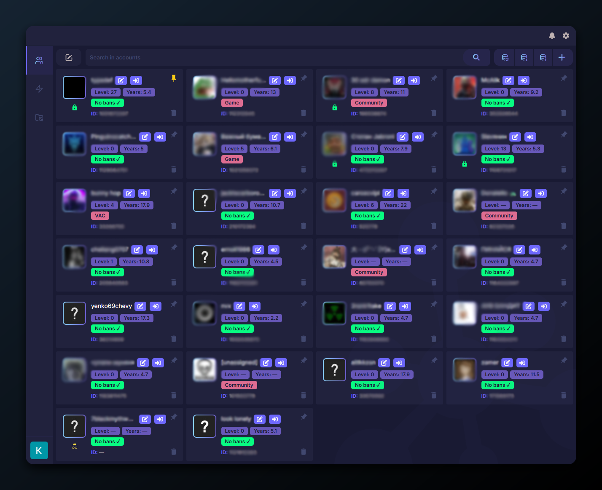
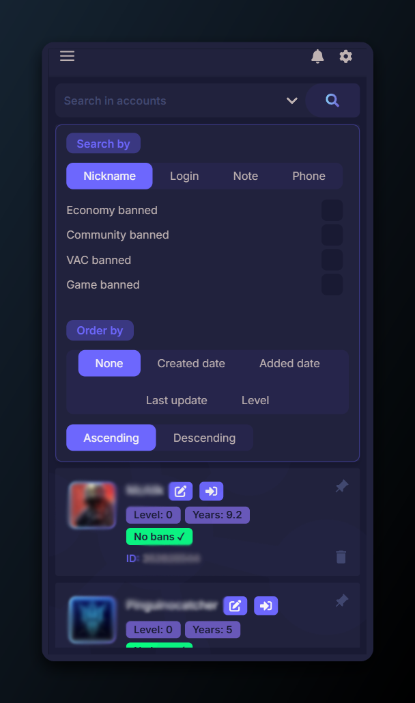
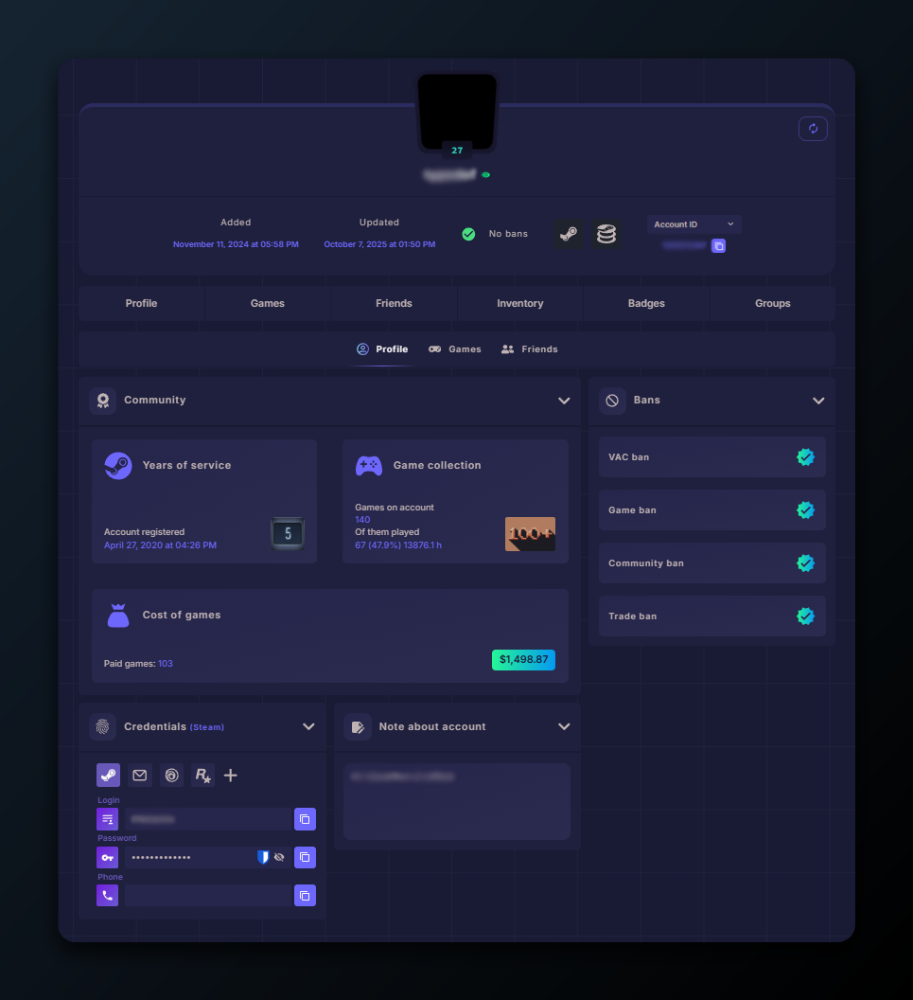
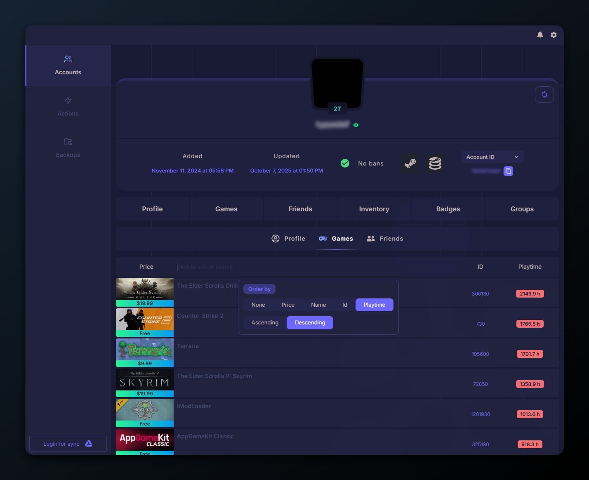
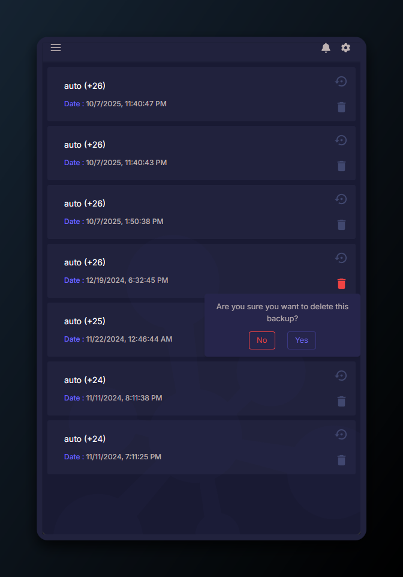

  <h1>WeMod Patcher</h1>

<h4>A comprehensive Steam account management service with advanced features for organizing, securing, and tracking your Steam accounts.</h4>

## 🌟 Key Features

### 🔐 Security & Privacy First
- **100% Local Storage** - All your data is stored locally on your device
- **End-to-End Encryption** - All passwords and sensitive information are encrypted
- **Google Drive Integration** - Optional encrypted backups to your personal Google Drive
- **Zero Server Storage** - Your passwords never leave your device unencrypted
- **No one can access your data** without your master password - even with access to backups

### 📊 Account Management
- **Comprehensive Account Information**
  - Steam credentials (login, password)
  - Account bindings (email, phone, Epic Games, etc.)
  - Personal notes
  - Steam profile integration
  
- **Account Value Tracking**
  - Total games library value
  - Steam id in many formats
  - Cost of games owned
  - Total playtime across all games
  - Useful links (profile, store, community, support)
  - Total number of games, friends
  - Ban status monitoring (VAC, Game bans, Community bans, Economy bans)
  - Account level
  - And more...

### ⚡ Performance & UX
- **Virtual Scrolling** - Handle thousands of accounts without performance degradation
- **Advanced Search** - Search by nickname, login, email, phone, notes
- **Smart Filtering** - Filter by ban status, account properties, custom flags
- **Drag & Drop** - Reorder accounts with intuitive drag-and-drop
- **Pin Important Accounts** - Keep frequently used accounts at the top

### 🔄 Backup & Sync
- **Google Drive Integration**
  - Automatic encrypted backups
  - Automatic synchronization across devices
  - Manual backup creation
  - Backup history management
  - Import/export snapshots
  - Delete old backups
  
- **Local Export/Import**
  - Export data with encryption
  - Import from encrypted files
  - Backup versioning

### 📱 Progressive Web App (PWA)
- **Install as App** - Install on desktop or mobile devices
- **Offline Mode** - Full functionality without internet connection
- **Cross-Platform** - Works on Windows, macOS, Linux, iOS, Android

## 🔒 Security Notes

- All sensitive data is encrypted using AES-256 encryption
- Master password is never stored or transmitted
- Backups on Google Drive are fully encrypted before upload
- The application works completely offline - no telemetry or tracking
- Your data belongs to you and stays with you

## ❓ FAQ

### Why do you need a server if the app is client-side only?

The server component is **only used to fetch Steam data** due to browser CORS restrictions. Browsers block direct requests to Steam's API from web applications for security reasons. 

The server acts as a simple proxy that:
- Fetches public Steam profile information
- Retrieves game library data and prices
- Updates account statistics

**Your passwords and sensitive data NEVER go through the server.** All encryption/decryption happens locally in your browser. The server never sees or stores any of your credentials.

### Why is this hosted on a domain? Looks like a scam...

**This is a legitimate concern!** Here's why it's hosted online:

1. **Convenience & Cross-Platform Access** - You can access your accounts from any device (PC, phone, tablet) using any modern browser without installing anything.

2. **It's Just Static Files** - When you visit the website, you're downloading static HTML, CSS, and JavaScript files. After that, everything runs locally in your browser.

3. **Fully Autonomous** - Once loaded, the app works completely offline. You can disconnect from the internet and still access all your data.

4. **Transparent & Verifiable** - The code is open-source. You can review it yourself to verify that nothing suspicious is happening.

5. **Self-Hosting Option** - If you're still concerned (which is totally valid for security-sensitive apps), you can easily host it on your own server or even run it locally.

**Security Best Practices:**
- ✅ Always verify the official repository URL
- ✅ Check the code yourself (it's open-source)
- ✅ Use self-hosting for maximum security
- ✅ Enable two-factor authentication on your Google account if using Drive sync

### How does offline mode work?

The app is a Progressive Web App (PWA) that caches all necessary files locally. Once you've visited the site once, it works completely offline thanks to Service Workers.

### What happens if I forget my master password?

Unfortunately, **there's no way to recover your data** without the master password. This is by design for security. The encryption is genuine - even the developer cannot access your data without your password.

**Always remember your master password or store it securely!**

### Can I use this without Google Drive?

Yes! Google Drive integration is completely optional. You can:
- Use the app entirely offline with local storage
- Export encrypted backups manually to your computer
- Never connect to Google Drive at all

## 🛠️ Technology Stack

**Web Client:**
- React 18 + TypeScript
- Vite
- TailwindCSS
- Framer Motion
- Google Drive API

**API Server:**
- .NET 8.0
- ASP.NET Core
- Steam Web API integration

## 📄 License

See [LICENSE.md](LICENSE.md) for details.

## 🤝 Contributing

Contributions are welcome! Please feel free to submit pull requests or open issues.

## 🖼️ Screenshots

### Accounts Management

*Manage all your Steam accounts in one place with virtual scrolling*

### Advanced Search & Filtering

*Powerful search and filtering capabilities*

### Account Profile

*Detailed account information and statistics*

### Games Library

*View all games with their values and playtime*

### Encrypted Backups

*Manage your encrypted backups in Google Drive*

## ⚠️ Disclaimer

**⚠️ Development Status:**
This project is currently **on hold/frozen**. I will continue development if there is any community interest or activity. Feel free to open issues, submit PRs, or star the repo to show your support!

**🔐 Security Warning:**
- **Always verify the URL** when using this application online
- **Beware of fake/phishing websites** that may impersonate this project
- For maximum security, it's recommended to **self-host** both the web client and API server
- Never enter your credentials on untrusted websites
- This application is open-source - you can review the code yourself

**⚖️ Legal:**
This is an unofficial tool and is not affiliated with or endorsed by Valve Corporation or Steam. Use at your own risk.
